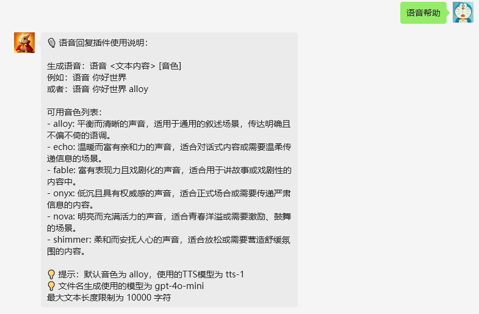
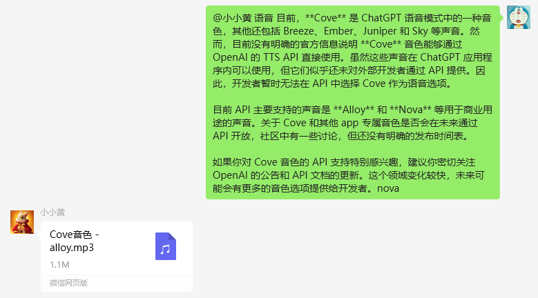

# VoiceReply 插件

VoiceReply 是一个为 [chatgpt-on-wechat](https://github.com/zhayujie/chatgpt-on-wechat) 项目开发的插件，用于生成指定音色的语音回复。

## 说明
**目前仅支持OpenAI的TTS服务。**

## 功能特点

- 支持多种音色的语音生成
- 自动生成简短的文件名
- 自动清理临时文件

## 安装

1. 将插件文件夹放入 `plugins` 目录
2. 重新命名`config.json.template`为`config.json`
3. 配置你的`config.json`

## 使用方法

1. 生成语音:
   - 使用默认音色: `语音 你好世界`
   - 使用特定音色: `语音 你好世界 alloy`

2. 获取帮助信息: `语音帮助`

## 配置说明

在 `config.json` 中:

- `api_key`: 你的OpenAI API密钥
- `base_url`: API的基础URL
- `max_chars`: 单次生成语音的最大字符数
- `model`: 使用的TTS模型
- `summary_model`: 用于生成文件名的模型
- `voices`: 可用音色列表及描述

## 文件名生成
 插件默认使用gpt-4o-mini模型进行文件名的生成。

**注意：可以配置别的模型，只要符合openai的api规范即可。**

## 演示图片

